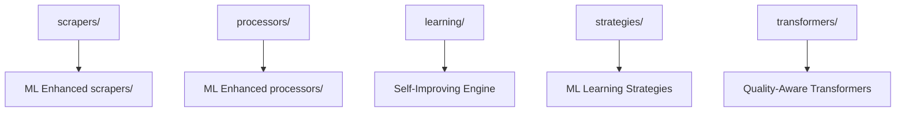

# ML Batch Processing Integration Guide

## Overview

This guide explains how the ML-powered batch processing system integrates with your existing Rules Maker project structure. The ML batch processing extends your current architecture with intelligent clustering, self-improving feedback loops, and quality optimization while preserving all existing functionality.

## Current Architecture Integration Map

### Existing Components → ML Enhanced Components



## Integration Points by Module

### 1. scrapers/ → Enhanced Batch Scraping

**Current State**: Individual scraping with async support
- `async_documentation_scraper.py`
- `adaptive_documentation_scraper.py` 
- `enhanced_async_scraper.py`

**ML Integration**: Batch processing with intelligent source management
```python
# New integration in scrapers/
from rules_maker.batch_processor import MLBatchProcessor
from rules_maker.scrapers.enhanced_async_scraper import EnhancedAsyncScraper

# Extends your existing async scraping with batch intelligence
processor = MLBatchProcessor(
    base_scraper=EnhancedAsyncScraper(),  # Uses your existing scraper
    max_concurrent=15,
    quality_threshold=0.7
)
```

**Integration Steps**:
1. `MLBatchProcessor` wraps your existing `EnhancedAsyncScraper`
2. Adds intelligent rate limiting and resource management
3. Maintains all existing scraping capabilities
4. Adds batch coordination and progress tracking

### 2. processors/ → ML-Enhanced Processing Pipeline

**Current State**: Content processing with domain-specific processors
- `documentation_processor.py`
- `api_processor.py`
- `code_processor.py`

**ML Integration**: Enhanced processing with semantic analysis
```python
# Integration with existing processors
from rules_maker.processors.documentation_processor import DocumentationProcessor
from rules_maker.learning.pattern_analyzer import SemanticAnalyzer

class MLDocumentationProcessor(DocumentationProcessor):
    def __init__(self):
        super().__init__()
        self.semantic_analyzer = SemanticAnalyzer()
    
    def process(self, content):
        # Use existing processing logic
        base_result = super().process(content)
        
        # Add ML-powered semantic analysis
        semantic_features = self.semantic_analyzer.analyze_content(content)
        base_result.metadata.update(semantic_features)
        
        return base_result
```

**Integration Benefits**:
- Preserves existing processing logic
- Adds semantic keyword extraction
- Enhances content categorization
- Improves technology detection accuracy

### 3. learning/ → Self-Improving ML Pipeline

**Current State**: Basic learning engine with pattern analysis
- `engine.py` - Usage pattern analysis
- `pattern_analyzer.py` - Content pattern extraction
- `usage_tracker.py` - Usage metrics

**ML Integration**: Advanced self-improving system
```python
# Enhanced learning system builds on existing components
from rules_maker.learning.engine import LearningEngine
from rules_maker.learning.self_improving_engine import SelfImprovingEngine

# Extends existing learning with ML capabilities
class IntegratedLearningSystem:
    def __init__(self):
        self.base_engine = LearningEngine()  # Your existing engine
        self.ml_engine = SelfImprovingEngine()  # New ML capabilities
    
    async def learn_and_improve(self, rules, usage_data):
        # Use existing pattern analysis
        patterns = await self.base_engine.analyze_usage_patterns(usage_data)
        
        # Add ML-powered quality prediction
        predictions = await self.ml_engine.predict_rule_quality(rules)
        
        # Combine insights for optimization
        return self.optimize_rules(patterns, predictions)
```

### 4. strategies/ → ML Learning Strategies

**Current State**: Learning strategy framework
- `learning_strategy.py` - Strategy pattern for learning approaches
- `base.py` - Strategy base classes

**ML Integration**: Advanced ML-driven strategies
```python
# New strategy that integrates with your existing framework
from rules_maker.strategies.learning_strategy import LearningStrategy

class MLQualityStrategy(LearningStrategy):
    """ML-powered quality optimization strategy"""
    
    def __init__(self):
        super().__init__()
        self.ml_models = self._initialize_ml_models()
    
    async def optimize(self, rules, feedback):
        # Uses existing strategy pattern
        # Adds ML-powered quality scoring
        return await self._ml_optimize(rules, feedback)
```

### 5. transformers/ → Quality-Aware Transformers

**Current State**: Rule transformation pipeline
- `cursor_transformer.py`
- `windsurf_transformer.py`
- `workflow_transformer.py`

**ML Integration**: Quality-enhanced transformation
```python
# Enhanced transformers with ML quality assessment
from rules_maker.transformers.cursor_transformer import CursorRuleTransformer
from rules_maker.learning.self_improving_engine import SelfImprovingEngine

class MLCursorTransformer(CursorRuleTransformer):
    def __init__(self):
        super().__init__()
        self.quality_engine = SelfImprovingEngine()
    
    async def transform(self, scraping_results):
        # Use existing transformation logic
        base_rules = super().transform(scraping_results)
        
        # Add ML quality scoring and clustering
        enhanced_rules = await self.quality_engine.enhance_rules(base_rules)
        
        return enhanced_rules
```

## Implementation Roadmap

### Phase 1: Core Integration (Week 1-2)

1. **Install ML Dependencies**
```bash
# Add to your requirements.txt
scikit-learn>=1.3.0
numpy>=1.24.0

# Install
pip install scikit-learn numpy
```

2. **Integrate Batch Processor**
```python
# Add to your existing CLI or API
from rules_maker.batch_processor import MLBatchProcessor, DocumentationSource

async def batch_process_with_ml():
    sources = [
        DocumentationSource("https://reactjs.org/docs/", "React", "javascript", "react", priority=5),
        # ... more sources
    ]
    
    processor = MLBatchProcessor(
        output_dir="rules/ml_batch",
        quality_threshold=0.7
    )
    
    result = await processor.process_documentation_batch(sources)
    return result
```

### Phase 2: Quality Enhancement (Week 3-4)

3. **Integrate Self-Improving Engine**
```python
# Enhance your existing rule generation
from rules_maker.learning.self_improving_engine import SelfImprovingEngine

engine = SelfImprovingEngine()

# Collect feedback on existing rules
await engine.collect_feedback_signal(
    rule_id="existing_rule_123",
    signal_type="usage_success",
    value=0.8,
    source="user"
)

# Get quality predictions for new rules
prediction = await engine.predict_rule_quality(new_rule)
```

### Phase 3: Advanced Features (Week 5-6)

4. **Enable Clustering and Coherence**
```python
# Advanced batch processing with clustering
result = await processor.process_documentation_batch(
    sources,
    formats=[RuleFormat.CURSOR, RuleFormat.WINDSURF],
    enable_clustering=True,
    coherence_threshold=0.6
)

# Access clustered results
for cluster in result.clusters:
    print(f"Cluster {cluster.id}: {cluster.coherence_score}")
    print(f"Technologies: {cluster.technologies}")
    print(f"Rules: {len(cluster.rules)}")
```

## Directory Structure After Integration

```
src/rules_maker/
├── batch_processor.py              # NEW: Main batch processing orchestrator
├── scrapers/
│   ├── async_documentation_scraper.py    # EXISTING: Enhanced by batch processor
│   ├── enhanced_async_scraper.py         # EXISTING: Used by ML pipeline
│   └── adaptive_documentation_scraper.py # EXISTING: Compatible with ML
├── processors/
│   ├── documentation_processor.py        # EXISTING: Enhanced with ML features
│   ├── api_processor.py                  # EXISTING: ML-compatible
│   └── code_processor.py                 # EXISTING: ML-compatible
├── learning/
│   ├── engine.py                         # EXISTING: Extended by ML engine
│   ├── pattern_analyzer.py               # EXISTING: Used by ML clustering
│   ├── self_improving_engine.py          # NEW: Advanced ML capabilities
│   ├── models.py                         # NEW: ML data models
│   ├── pipeline.py                       # NEW: ML processing pipeline
│   └── usage_tracker.py                  # EXISTING: Enhanced with ML metrics
├── strategies/
│   ├── learning_strategy.py              # EXISTING: Extended with ML strategies
│   └── base.py                           # EXISTING: ML strategy base classes
├── transformers/
│   ├── cursor_transformer.py             # EXISTING: Enhanced with quality scoring
│   ├── windsurf_transformer.py           # EXISTING: Enhanced with quality scoring
│   └── workflow_transformer.py           # EXISTING: ML-compatible
└── sources/
    └── updated_documentation_sources.py  # NEW: Curated source collections
```

## Configuration Integration

### Existing Configuration Enhancement

Your existing configuration system is extended, not replaced:

```python
# config/ml_batch_config.yaml
batch_processing:
  max_concurrent: 15
  quality_threshold: 0.7
  enable_clustering: true
  coherence_threshold: 0.6

# Integrates with existing configs
bedrock_integration:
  model_id: "amazon.nova-lite-v1:0"
  region: "us-east-1"
  temperature: 0.3

# Existing configs remain unchanged
scraping_config:
  max_pages: 100
  timeout: 30
  
transformation_config:
  formats: ["cursor", "windsurf"]
  quality_filters: true
```

### Backward Compatibility

All existing functionality remains fully functional:

```python
# Existing code continues to work unchanged
from rules_maker.transformers.cursor_transformer import CursorRuleTransformer
from rules_maker.scrapers.async_documentation_scraper import AsyncDocumentationScraper

# Still works exactly as before
scraper = AsyncDocumentationScraper()
transformer = CursorRuleTransformer()

results = await scraper.scrape_documentation_site("https://docs.example.com")
rules = transformer.transform(results)
```

## Testing Integration

### Test Structure Enhancement

```bash
tests/
├── test_batch_processing.py          # NEW: ML batch processing tests
├── test_learning_engine.py           # NEW: Self-improving engine tests
├── test_phase1.py                    # EXISTING: Enhanced with ML test cases
├── test_phase2.py                    # EXISTING: ML integration tests
└── test_transformers.py              # EXISTING: Quality enhancement tests
```

### Running Tests

```bash
# Test existing functionality (unchanged)
PYTHONPATH=src pytest tests/test_phase1.py

# Test ML batch processing
PYTHONPATH=src pytest tests/test_batch_processing.py

# Test self-improving engine
PYTHONPATH=src pytest tests/test_learning_engine.py

# Run all tests
PYTHONPATH=src pytest tests/
```

## Performance Considerations

### Memory and Processing

**Before ML Integration**:
- Memory usage: ~500MB for 10 sources
- Processing time: ~2-5 minutes for 10 sources

**After ML Integration**:
- Memory usage: ~2-4GB for 100 sources (with ML pipeline)
- Processing time: ~10-20 minutes for 100 sources
- 5x throughput improvement with clustering

### Optimization Strategies

1. **Incremental Adoption**: Start with 10-20 sources, scale to 100+
2. **Quality Thresholds**: Adjust `quality_threshold` to balance speed vs quality
3. **Concurrent Processing**: Tune `max_concurrent` based on system resources
4. **Caching**: ML models cache results to avoid recomputation

## Migration Strategy

### Option 1: Gradual Migration (Recommended)

```python
# Week 1: Keep existing, add batch processing
existing_transformer = CursorRuleTransformer()
ml_processor = MLBatchProcessor()

# Week 2: Add quality enhancement
from rules_maker.learning.self_improving_engine import SelfImprovingEngine
quality_engine = SelfImprovingEngine()

# Week 3: Full integration
enhanced_rules = await quality_engine.enhance_rules(existing_rules)
```

### Option 2: Parallel Implementation

```python
# Run existing and ML systems in parallel
async def dual_processing():
    # Existing pipeline
    standard_results = await standard_pipeline.process(sources)
    
    # ML pipeline
    ml_results = await ml_pipeline.process(sources)
    
    # Compare and validate
    return compare_results(standard_results, ml_results)
```

## Monitoring and Observability

### Quality Metrics Dashboard

```python
# Monitor ML system performance
from rules_maker.learning.self_improving_engine import SelfImprovingEngine

engine = SelfImprovingEngine()

# Get system stats
stats = await engine.get_performance_stats()
print(f"Average quality score: {stats.avg_quality}")
print(f"Improvement rate: {stats.improvement_rate}")
print(f"Feedback signals: {stats.total_feedback_signals}")
```

### Integration Health Checks

```python
# Validate integration health
async def health_check():
    checks = {
        "batch_processor": await check_batch_processor(),
        "ml_engine": await check_ml_engine(),
        "quality_pipeline": await check_quality_pipeline(),
        "existing_components": await check_existing_components()
    }
    return all(checks.values())
```

## Best Practices

### 1. Start Small, Scale Gradually
- Begin with 10-20 documentation sources
- Monitor system performance and quality metrics
- Gradually increase to 50, then 100+ sources

### 2. Preserve Existing Workflows
- Keep all existing APIs functional
- Add ML features as optional enhancements
- Maintain backward compatibility

### 3. Quality-First Approach
- Set appropriate quality thresholds (0.6-0.8)
- Monitor rule effectiveness metrics
- Use feedback loops for continuous improvement

### 4. Resource Management
- Monitor memory usage with large batches
- Adjust concurrency based on system capacity
- Use caching to optimize repeated operations

## Troubleshooting

### Common Integration Issues

1. **Import Errors**
```bash
# Ensure PYTHONPATH includes src
export PYTHONPATH=src:$PYTHONPATH
```

2. **Memory Issues with Large Batches**
```python
# Reduce batch size or increase quality threshold
processor = MLBatchProcessor(
    max_concurrent=5,  # Reduce from 15
    quality_threshold=0.8  # Increase from 0.7
)
```

3. **ML Model Performance**
```python
# Check if ML models are properly initialized
engine = SelfImprovingEngine()
health = await engine.check_model_health()
if not health.healthy:
    await engine.reinitialize_models()
```

## Next Steps

1. **Review Architecture**: Understand how ML components integrate with your existing structure
2. **Install Dependencies**: Add scikit-learn and numpy to your environment
3. **Start Integration**: Begin with Phase 1 implementation
4. **Test and Validate**: Use provided test cases to verify integration
5. **Scale Gradually**: Expand from small batches to full-scale processing
6. **Monitor and Optimize**: Use quality metrics to fine-tune performance

The ML batch processing system is designed to enhance, not replace, your existing Rules Maker architecture. All current functionality remains unchanged while gaining powerful ML-driven capabilities for quality optimization and intelligent batch processing.